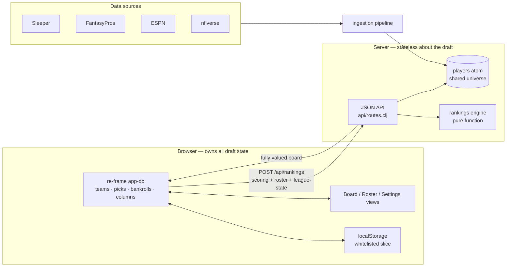
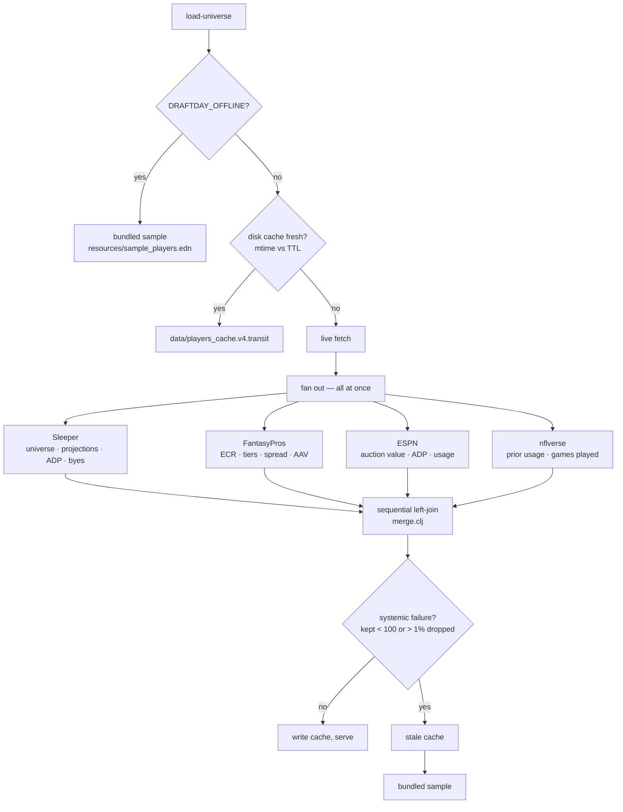

# Draft Day

A fantasy football draft assistant for **auction** drafts. It turns your
league's own scoring rules and roster slots into a live dollar value for every
player on the board, and re-prices the whole board after every pick.

Clojure backend serving a stateless JSON API; a ClojureScript/re-frame SPA
renders the board and owns all draft state in the browser.


<sub>Screenshots throughout are captured against the bundled offline universe,
which is why the status line reads `sample` — that is real data from
`resources/sample_players.edn`, not placeholder rows.</sub>

## Contents

- [Why this exists](#why-this-exists)
- [Fantasy football, and the math, in one pass](#fantasy-football-and-the-math-in-one-pass)
- [Quick start](#quick-start)
- [Using it](#using-it)
- [Architecture](#architecture)
  - [Ingestion](#ingestion) · [Rankings engine](#rankings-engine)
- [The data](#the-data)
  - [Sources](#sources) · [Shape of a player](#shape-of-a-player) · [Cache and provenance](#cache-and-provenance)
- [The math](#the-math)
  - [Points](#points--scoringcljc--points) · [Floor / ceiling](#floor--ceiling--projectionsclj--floor-ceiling) · [Replacement level and VORP](#replacement-level-and-vorp--replacementclj--vorp) · [Tiers](#tiers--tiersclj--tiers-tier) · [Value](#value--valueclj--value) · [Inflation](#inflation--inflationclj-inflation_indexclj) · [Worth and Bargain](#worth-and-bargain--valueclj-engineclj--worth-bargain) · [Injury risk](#injury-risk--injuryclj--injury-risk) · [Signals that feed nothing](#signals-that-feed-nothing)
- [API](#api)
  - [`POST /api/rankings`](#post-apirankings) · [`POST /api/league/import`](#post-apileagueimport)
- [Development](#development)
- [Research harnesses](#research-harnesses)
  - [Benchmark](#benchmark) · [Replay](#replay)
- [Further reading](#further-reading)
- [License](#license)

## Why this exists

Almost every draft tool is built for **snake** drafts, where a ranked list is
the whole answer — when your turn comes, take the highest name left. An auction
asks a different question. Every player is available to everyone, all the time,
and the only thing you ever decide is *what is he worth to me, right now, with
this much money left*. A ranking cannot answer that. A price can.

Three things follow from that, and they are what this app is:

**1. Prices have to come from your league.** Consensus auction values from ESPN
or FantasyPros are priced for a generic 12-team PPR league with a generic
roster. Change the reception weight to 0.5 and every receiver is worth less;
add a second flex and every running back is worth more. Draft Day derives its
dollars from *your* scoring weights and *your* roster slots, and shows the
consensus alongside — as the `Mkt` and `Edge` columns — rather than as the
answer.

**2. Prices have to move as the room drafts.** Money spent is money gone. When
the first fourteen players off the board go $114 over their model value, that
$114 came out of the room's remaining budget — so everyone still available just
got *cheaper*, and the board has to say so:


The header tells both halves of that story. **Infl Idx** is `$114` — the room
is overpaying. **Market** has fallen to `×0.91` — which is the *consequence*:
with the discretionary money drained, every remaining price comes down. That
inversion is the point. A tool that just showed you the overpay would have you
believe the draft got more expensive; what actually happened is that value is
now on sale.

**3. The board has to be honest about what it does not know.** Every display
signal that is not a price is kept out of the price. Injury risk, tier cliffs
and the market consensus are shown as columns and feed nothing, because the
market price already carries the room's injury opinion — discounting Worth by
risk would charge a fragile player twice.

## Fantasy football, and the math, in one pass

If you have never priced an auction board, these are the terms, in the order
the code computes them. Each names the namespace that implements it.

**Projection** — a vendor's guess at a player's raw stat line for the season:
so many rushing yards, so many receptions. Draft Day does not project; it
consumes Sleeper's projections.

**Points** (`scoring.cljc`) — a projection scored by *your* rules.
`points = Σ(projected stat × your weight)` over 21 stat keys. This is the only
place your league's settings enter the math, and everything downstream is
denominated in it.

**Replacement level** (`replacement.clj`) — the score of the best player at a
position you could get *for free*, because he is the first one who will not be
started. In a 12-team league starting 2 RBs, twenty-four running backs come off
the board as starters, so RB #25 is roughly replacement level. Points below
that line are worth nothing: you could have had them for a dollar.

**VORP — Value Over Replacement Player** (`replacement.clj`) — the whole idea
in one subtraction: `vorp = points − replacement_level_at_his_position`. A back
projected for 190 points against a 150-point replacement has **40 VORP** — 40
points you genuinely could not have had for free. This is the only number that
compares a quarterback to a tight end, because it has already divided out how
deep each position is.

**VBD — Value Based Drafting** — the strategy VORP serves: draft the biggest
VORP, not the biggest points total. The elite QB scores more raw points than
the elite RB every year and is still usually the worse buy, because the QB you
could have had for free is nearly as good.

**Value** (`value.clj`) — VORP converted into dollars, and the answer to "what
is he worth in a vacuum". Reserve the league minimum for every roster slot,
then split what is left in proportion to VORP:

```
value = 1 + (vorp / Σvorp) × (budget − total_roster_slots)
```

By construction the board's Values sum to the league's whole budget (within
per-player rounding), which is what makes them comparable to real prices.

**Inflation** (`inflation.clj`) — the live correction. Add up the cash the room
still has, subtract the dollar-per-slot it must reserve, and divide by what the
remaining players are *supposed* to cost. Above 1.0 the room has more money
than board left and everything is about to get expensive; below 1.0 it has
overspent and the rest is on sale. Clamped to `[0.5, 1.8]`, further tilted per
position (a room that has already blown its money on running backs inflates
running backs, not tight ends) and decayed as slots fill (`1 − 0.2t²`), since a
multiplier means less when there are three picks left.

**Worth** (`value.clj`) — Value put through that live multiplier. **This is the
number to bid to.** `worth = 1 + (value − 1) × multiplier`.

**Bargain** (`engine.clj`) — `value − worth`. Positive means the live market is
colder than the player's standalone value: buy. Negative means you are reaching.

**Tiers** (`tiers.clj`) — where the board *cliffs*. Players are sorted and cut
at the largest gaps in score, so a tier is a set of players who are genuinely
interchangeable. The practical use is nomination timing: with six players left
in a tier you can wait, and with one you cannot.

**ECR / ADP / AAV** — the outside world's opinions, carried as columns. ECR is
FantasyPros' Expert Consensus Rank, ADP is Sleeper's Average Draft Position,
AAV is Average Auction Value. `Mkt` blends the auction values into your
league's budget, and `Edge` is `Worth − Mkt` — where the model disagrees with
the room.

**Injury risk** (`injury.clj`) — a 1-5 durability scale from games missed per
season. It measures **availability, not injury**: the evidence is games played,
so a benching counts the same as a hamstring.

## Quick start

**Prerequisites**: JDK 17+, [Leiningen](https://leiningen.org/), Node 18+.

```bash
git clone https://github.com/RockChalkJay/draft-day-clj.git
cd draft-day-clj
npm install

# macOS/Homebrew only: the JDK is keg-only and not on PATH. `lein` finds Java
# on its own, but shadow-cljs needs JAVA_HOME exported first.
export JAVA_HOME=/opt/homebrew/opt/openjdk/libexec/openjdk.jdk/Contents/Home

npx shadow-cljs release app     # compile the SPA into resources/public/js
lein run                        # serve it on http://localhost:8080
```

First run pulls a live player universe from Sleeper, FantasyPros and ESPN,
which takes a minute. To skip the network entirely and boot off the bundled
sample universe:

```bash
DRAFTDAY_OFFLINE=1 lein run
```

**Development loop** — run two processes and use **one port**. `npx shadow-cljs
watch app` rebuilds `main.js` into `resources/public/js` on every save; `lein
run` serves that same directory *and* the API on **:8080**. Point your browser
at :8080 and let `watch` recompile underneath it.

shadow-cljs also serves `resources/public` on :8280, but nothing answers
`/api/*` there, so the board cannot load players from it.

| Env var | Default | Effect |
| --- | --- | --- |
| `PORT` | `8080` | server port |
| `DRAFTDAY_OFFLINE` | unset | `1` forces the bundled sample universe — no network calls |
| `DRAFTDAY_CACHE_TTL_HOURS` | `24` | how long the on-disk player cache stays fresh |

## Using it

**Set up the league.** In **Settings**, paste a Sleeper league ID to pull its
real scoring and roster settings, or set them by hand. An import reports
exactly which of your league's rules it could *not* apply — see
[docs/scoring-coverage.md](docs/scoring-coverage.md), because a config that
looks complete but scores differently is worse than one that admits its gaps.


**Run the draft.** Click a player to put him **on the block**, then enter the
winning price and the team that got him. Every pick re-prices the whole board.
The header tracks your bankroll and your **max bid** — the most you can spend
and still fill every remaining slot at a dollar.

**Read the board.** The columns that are not self-evident:

| Column | Means |
| --- | --- |
| `Worth` | **the number to bid to** — Value scaled by live inflation |
| `Value` | the stable, inflation-free dollar value |
| `Barg` | `Value − Worth`; green is a target, red is a reach |
| `VORP` | points above replacement at his position |
| `Mkt` | ESPN + FantasyPros consensus price, rescaled to your budget |
| `Edge` | `Worth − Mkt`; green means the model likes him more than the room |
| `Tier` | which cliff he sits above |
| `Risk` | 1-5 durability, from games missed per season |

**Filter to a position and the tier scale changes with it.** Unfiltered, `Tier`
is an *overall* tier cut on VORP — the only score that compares a QB to a WR.
Filter to RB and it becomes RB's own tier, cut on points within the position,
because "tier 2 RB" and "tier 2 WR" mean nothing next to each other. The board
switches with no round trip, since the server ships both scales on every player.


## Architecture

`src/clj` is the backend, `src/cljs` the SPA, `src/cljc` the code both halves
share — the app-db shape, the column catalog and the scoring table, which the
browser needs synchronously and the JVM needs to compute with.



The server keeps **no draft state**. The only thing it holds across requests is
the shared player universe. Every `POST /api/rankings` carries the browser's
entire `league-state` — teams, picks, bankrolls — so the rankings engine is a
pure function of `(players, scoring, roster-config, league-state)`. There is no
session to reconcile, no way for two tabs to disagree, and the whole valuation
is reproducible from one request body.

**Frontend flow**: `:boot` merges the persisted localStorage slice into
`default-db` → `:fetch-players` → `:recompute` → `:ranked-loaded` stashes the
response. Every mutating event re-dispatches `:recompute`. Two details carry
weight: each `:recompute` stamps a monotonic `:recompute-seq` that
`:ranked-loaded` checks before writing, because a full re-rank takes long
enough that overlapping requests answer out of order and a reply computed under
the *previous* scoring config could otherwise win; and `db/reconcile-config` /
`reconcile-columns` repair a persisted blob at boot, since localStorage carries
no schema stamp and every shape the app has ever written has to be repairable
in place.

### Ingestion



Fetches all start at once; the *joins* stay sequential and in a fixed order so
the `:sources` provenance report reads the same every run. Per-vendor
politeness lives with the vendor: FantasyPros is held to 3 in-flight
connections, because twenty simultaneous scrapes from one IP earn a 429 — and
a 429 here is not an exception but a silently empty column cached for a day.
The validation gate matters for the same reason: a live fetch that comes back
gutted throws rather than overwriting a good cache with a bad one.

### Rankings engine

```mermaid
flowchart LR
    subgraph static["static-rankings — once per scoring/roster config"]
        direction LR
        p1["model<br/>:points"] --> p2["projections<br/>:floor :ceiling"]
        p2 --> p3["replacement<br/>levels"]
        p3 --> p4["VORP<br/>:vorp"]
        p4 --> p5["tiers<br/>:tiers :tier"]
        p5 --> p6["injury<br/>:injury-risk"]
    end

    subgraph live["live-valuation — after every pick"]
        direction LR
        l1["tcm<br/>:tcm"] --> l2["value<br/>:value"]
        l2 --> l3["inflation<br/>global"]
        l3 --> l4["phase decay"]
        l4 --> l5["per-position<br/>inflation"]
        l5 --> l6["worth<br/>:worth"]
        l6 --> l7["bargain<br/>:bargain"]
    end

    static --> live
    live --> mkt["market<br/>:market :edge"]
    mkt --> resp["JSON response"]
```



The split is the load-bearing part: the static half depends only on your
scoring and roster settings, so it is computed once; the live half is
everything a pick can move. Two ordering constraints are real — VORP must
precede tiering, because the overall tier scale cuts on VORP; and the
inflation band is applied exactly once, at the very end, to the finished
`position_inflation × phase_decay` product.

## The data

### Sources

| Source | Endpoint | Contributes | Joined on |
| --- | --- | --- | --- |
| **Sleeper** | `api.sleeper.app/projections/nfl/{season}` | the player universe itself: name, position, team, the projected stat line, ADP, injury status, years of experience | — (it *is* the universe) |
| **Sleeper** | `api.sleeper.app/schedule/nfl/regular/{season}` | bye weeks, derived as the one missing week per team | team |
| **FantasyPros** | `/nfl/rankings/…cheatsheets.php` | ECR, positional rank, expert tier, and the rank spread that becomes floor/ceiling | name + position |
| **FantasyPros** | `draftwizard.fantasypros.com/auction/…` | AAV — consensus auction value | name + position |
| **ESPN** | `lm-api-reads.fantasy.espn.com/…/players` | live auction value, ADP, projected targets and receptions | name + position |
| **nflverse** | `nflverse-data` release CSVs | last season's realized usage, and games played over three seasons for the durability scale | **GSIS id — exact** |
| **DynastyProcess** | `db_playerids.csv` | the id crosswalk tying those together. Pinned as a snapshot at `resources/player_ids.edn`, not fetched at runtime | — |

Sleeper defines the rows; everything else is a **best-effort left join**. A
source that fails leaves its column empty and the board still renders — it just
says so in the provenance report. Unmatched enrichment rows are dropped, never
added.

Name matching (`match.clj`) lowercases, strips generational suffixes
(`jr`/`sr`/`ii`/`iii`/`iv`/`v`) and all non-alphanumerics, then concatenates
with position: `"T.J. Hockenson", "TE"` → `tjhockenson_te`. nflverse is the one
source that joins exactly, on the GSIS id every universe player already carries.

### Shape of a player

```clojure
{:player-id "00-0038563"          ; GSIS id where resolvable, else Sleeper id
 :ids {:sleeper "10213" :gsis "00-0038563" :fantasypros "25337"
       :espn "4428718" :pfr "TuckTr00"}
 :player-name "Tre Tucker" :position "WR" :team "LV" :bye 13

 ;; the projected stat line — the only input to :points
 :stats {:rec 3.0 :rec_yd 32.0}

 :sleeper/years-exp 3
 :sleeper/injury-status nil

 ;; ESPN is deliberately NOT format-scoped: it publishes the same auction
 ;; value under both its PPR and STANDARD rank types.
 :espn/adp 168.17
 :espn/auction-value 0.24
 :espn/proj-receptions 48.41

 ;; nflverse. :games-by-season is what he played; :games-seasons is how long
 ;; each season was — a consumer has to tell a season the player missed from
 ;; a season the network missed.
 :nflverse/prior-season 2025
 :nflverse/prior-games 17.0
 :nflverse/prior-targets 92.0
 :nflverse/prior-target-share 0.013
 :nflverse/games-by-season {2023 9.0 2024 15.0 2025 6.0}
 :nflverse/games-seasons   {2023 17  2024 17  2025 17}

 ;; columns vendors publish PER SCORING FORMAT, kept side by side
 :vendor/by-format
 {:ppr {:fantasypros/ecr 157 :fantasypros/pos-rank "WR60"
        :fantasypros/ecr-tier 9 :fantasypros/ecr-pos-tier 7
        :fantasypros/rank-ave 168.08 :fantasypros/rank-std 28.09
        :fantasypros/rank-min 116 :fantasypros/rank-max 291
        :fantasypros/aav 1.0 :sleeper/adp 203.7}
  :half-ppr {…}
  :standard {…}}}
```

**Why `:vendor/by-format` exists.** The universe cache is shared across
leagues, so which scoring format a vendor column should be read at cannot be
decided at ingestion time. Every format-scoped column is fetched for all three
formats and stored side by side; `rankings/vendor.clj` flattens the matching
one onto flat keys per request. Baking in PPR is what once made a standard
league read PPR tiers, PPR market prices and PPR ADP while reporting a full
row count.

### Cache and provenance

The universe is cached to `data/players_cache.v4.transit`. The schema version
rides in both the filename and the payload, so bumping it orphans the old file
rather than silently reusing an incompatible one. Freshness is file mtime
against `DRAFTDAY_CACHE_TTL_HOURS`. `POST /api/cache/reset` drops it.

Every join reports itself, and `GET /api/players` returns the report under
`:universe`:

```clojure
{:rows 148 :matched 147 :hit-rate 0.9932 :coverage 0.2318
 :by-position {"WR" {:n 216 :rows 47 :matched 47} …}
 :unmatched-sample ["ajdillon_rb"]
 :ok? true :expected-partial? false}
```

A hit rate under 0.80 raises a per-position warning unless the source is
declared partial. This is the difference between "ESPN prices are missing" and
"ESPN prices are missing *for tight ends*", which is the one you need during a
draft.

## The math

Each stage, what it means, the formula as implemented, and the key it writes.
Constants are named where the code names them.

### Points — `scoring.cljc` → `:points`

`points = Σ(projected stat × weight)` over the 21 keys in `scoring/stat-keys`.
Presets differ only in the reception weight: `:standard` 0.0, `:half-ppr` 0.5,
`:ppr` 1.0. A custom or imported league carries a full `{stat-key weight}` map
instead of a preset keyword, and the vendor format to read is *derived* from
its reception weight rather than stored — `< 0.25` standard, `< 0.75` half,
else PPR.

Rules with a shape other than "stat × weight" — FG distance buckets, tiered
points-allowed, yardage bonuses — have nowhere to land. See
[docs/scoring-coverage.md](docs/scoring-coverage.md) for exactly which, and
what each one costs.

### Floor / ceiling — `projections.clj` → `:floor` `:ceiling`

Expert *disagreement* stands in for uncertainty:

```
band    = k_pos × min(1, rank_std / 10)
ceiling = points × (1 + band)
floor   = points × (1 − band)
```

`k_pos` is 0.20 for QB, 0.35 for RB and WR, 0.40 for TE, 0.15 K, 0.25 DST —
tight ends are the position the experts agree on least.

### Replacement level and VORP — `replacement.clj` → `:vorp`

```
idx_pos   = num_teams × starters_pos + flex_claims_pos
level_pos = points of the player at that index
vorp      = points − level_pos
```

**Flex claims are measured, not assumed.** Pool everyone left after each
position's dedicated starters, rank that pool on its own merits, take the best
`num_teams × flex_spots`, and count what positions they actually are. Splitting
the flex 50/50 RB/WR — the obvious guess — put PPR running-back replacement six
slots too deep, handing every RB about +14.6 phantom points and roughly +$9.
The measured claims are nothing like even: standard is RB 7 / WR 5, PPR is
WR 12 / RB 0.

Two deliberate choices. VORP is **signed**, not floored at zero — flooring
collapsed 549 of 633 sample players to 0.0 and destroyed the ordering of the
entire back half of the draft. And K/DST get `nil`, not `0.0`, because a 0.0
reads as *at replacement* and floated all 76 specialists above every
below-replacement skill player.

### Tiers — `tiers.clj` → `:tiers` `:tier`

Sort the pool, then greedily cut at the largest **absolute** gaps, taking a cut
only if both segments it creates stay at or above `MIN-TIER-SIZE` (2) — "a
one-player tier is not a tier, it is a rank with extra styling". Tiers are
**sized**, not counted: `tier_count = clamp(round(n / target), 2, 12)` with
`TARGET-TIER-SIZE` of 4 within a position and 12 overall. Everything at or
below replacement shares one final tail tier.

Absolute gaps rather than relative drops, because a relative drop is measured
against a falling number and so grows without bound as points decay — it
dragged nearly every cut into the tail and produced one 13-player top tier
above four 2-player tiers, exactly backwards.

Both scales are always computed: `:position` cuts on points within a position,
`:overall` cuts on VORP across the whole board. K and DST have no replacement
level, so they get a floor at the `num_teams`-th best kicker — otherwise
tiering spends every tier on 44 kickers.

### Value — `value.clj` → `:value`

```
discretionary = budget − total_roster_slots
value         = 1 + (vorp / Σvorp) × discretionary
```

Reserve the league minimum for every slot, then split what is left by VORP
share among the players who will actually be bought. The tail — everyone below
replacement, plus exactly as many kickers and defenses as the roster drafts —
is priced at `MIN-BID` of $1, apportioned **per position** by largest
remainder. Ranking that tail globally by VORP instead gave tight ends 27 of 96
minimum-bid slots against 12 TE starters.

Values sum to the budget within per-player rounding — about $2398 of $2400 on
the sample, since each player is rounded independently.

### Inflation — `inflation.clj`, `inflation_index.clj`

```
inflation = clamp( (remaining_cash − remaining_slots) / expected_premium,
                   0.5, 1.8 )
```

where `expected_premium` sums `max(0, value − 1)` over only the top
`remaining_slots` undrafted players, so a deep tail of $1 filler cannot dilute
it.

**Phase decay**: `1 − 0.2t²`, `t` = fraction of slots filled. 1.00 at the open,
0.80 when rosters are full — a multiplier means less with three picks left.

**Per position**: `global × (1 + 0.5 × (ratio_p − 1) × Σpar_p/(Σpar_p + 20))`,
where `ratio_p` is dollars paid over par at that position. The shrinkage term
is load-bearing: without it a $3 bid on a $1 flier reads as a 3× overpay and
pins the position at the top of the band on the first nomination, pricing a $40
back at $63.

The band is applied **once**, at the very end, to the finished
`position × decay` product. Clamping in the middle produced a no-pick position
priced *below* the global factor, and decaying after the clamp produced an
effective range outside both published bounds.

**Inflation Index** is a separate diagnostic, not a multiplier:
`Σ(price_paid − par_value)` over picks at priced positions. Rising means the
room is overpaying. K and DST are excluded because the board never prices them
— including them had a room paying par on all 180 picks still report +$24.

### Worth and Bargain — `value.clj`, `engine.clj` → `:worth` `:bargain`

```
worth   = 1 + (value − 1) × multiplier
bargain = value − worth
```

The `$1` base keeps every minimum-bid player at $1 at any inflation. Drafted
players get `0`.

### Injury risk — `injury.clj` → `:injury-risk`

Games missed per season over the last `min(3 fetched seasons, years_exp)`
seasons, banded at `[0.5, 1.5, 3.0, 5.0]` into 1-5, and floored at 5 by a
serious current designation (IR, PUP, NFI, suspension — membership is by
*duration*, not severity, so Questionable and even Out are excluded on a
preseason board).

Two things are load-bearing. **The denominator is years in the league**, not
the width of the window: scored over a flat three seasons, the most fragile
players in football come out as last year's rookie class, who were not in the
league for two of them. And it measures **availability, not injury** — the
evidence is games played, so a benching counts like a hamstring, which is why
the column says "games missed" and never "injured". A player with no history to
judge is left blank rather than guessed at.

This is also deliberately *not* built on the weekly injury report: a player on
season-ending IR drops off that report entirely, so counting designations would
rate the worst injury of the season as iron-man durable.

### Signals that feed nothing

`:tcm` (tier-cliff multiplier), `:injury-risk`, and `:market`/`:edge` are
display columns and inputs to no price. Injury is the clearest case: market
prices already carry the room's injury opinion, so discounting Worth by risk
would charge a fragile player twice. The cautionary tale is the positional
demand multiplier, which was computed on every pick and consumed by nothing
until it was removed.

Valuation is hardwired to one weighting. There is no user-selectable strategy
profile — effective points equal raw points, VORP is not scarcity-adjusted, and
inflation sensitivity is fixed at 1.0.

## API

Kebab-case on the wire — JSON keys decode straight to keywords, with no
camelCase conversion.

| Method | Path | Does |
| --- | --- | --- |
| `GET` | `/api/health` | liveness |
| `GET` | `/api/players` | the cached universe + its provenance. `?refresh=true` forces a reload |
| `POST` | `/api/rankings` | the fully valued board |
| `POST` | `/api/league/import` | proxy a league's real settings from its host |
| `POST` | `/api/cache/reset` | drop the on-disk universe cache |

### `POST /api/rankings`

```clojure
;; request
{:num-teams          12
 :scoring            :ppr            ; preset keyword, or a {stat-key weight} map
 :replacement-config {:qb 1 :rb 2 :wr 2 :te 1 :flex 1}
 :league-state       {:teams [{:team-id "t0" :bankroll 200.0
                               :roster [{:pos "RB" :player-id nil} …]} …]
                      :drafted-player-ids ["00-0038563" …]
                      :starting-bankroll  200.0
                      :picks [{:player-id … :position "RB" :price 47} …]}}

;; response
{:inflation       0.92    ; global conserving factor, banded
 :inflation-index 114.0   ; Σ(paid − par) — rising means the room is overpaying
 :market-heat     0.99    ; phase decay
 :players         [ … ]}  ; every player, every key from every stage
```

Two guards return `400` before any work happens: a scoring config with no
non-zero weight on a projected stat (an all-zero board is a lie, not a board),
and a bankroll that cannot cover $1 per roster slot.

### `POST /api/league/import`

Takes `{:provider :sleeper :league-id "…"}` and returns the league's scoring
and roster settings, plus `:unsupported-scoring` — the rules a flat stat-line
model cannot score. Providers are a multimethod pair (`fetch-raw-league`,
`normalize-league`); adding one is a new namespace with two `defmethod`s and a
`:require` for its registration. It is backend-proxied rather than called from
the browser so that a provider needing server-side auth is a drop-in.

## Development

```bash
lein test                                        # all Clojure tests
lein test draft-day.rankings.value-test          # one namespace
lein test :only draft-day.rankings.value-test/value-conserves-to-budget
npm test                                         # the ClojureScript node-test build
```

`src/cljc` is on the JVM classpath, so `lein test` already covers the shared
db/scoring code. `npm test` exists for the cljs-only namespaces — `events`,
`fx`, `subs` — that `lein test` cannot reach, so a ClojureScript test is only
worth writing for genuinely browser-side behaviour.

## Research harnesses

`dev/` holds two research tools. **They are not part of the shipped API or
SPA**, and their caches under `data/` are gitignored and re-fetchable. Both are
in the `:dev` profile, which Leiningen activates by default for
`run`/`test`/`repl` — no `with-profile` needed.

### Benchmark

Scores a ranking model — or two, head to head — against real historical draft
outcomes, gated against post-hoc leakage.

```
lein run -m draft-day.benchmark.report --help
```

- `--models M[,M]` / `--compare A B` — score one or more models, or two side by side
- `--seasons 2021-2025` — which seasons to score
- `--simulate` — draft a team off each board and score realized points, the
  metric closest to the actual decision
- `--source-report` — per-source depth, join rates, and vintage gate
- `--power-report` — what the corpus can resolve before running a sweep

Plus tuning flags (`--scoring`, `--truth`, `--pool`, `--adp-source`,
`--projection-source`). Example:

```
lein run -m draft-day.benchmark.report --compare points points+adp --simulate
```

This is the seam the shipped engine leaves open: scoring is a multimethod
dispatch on a `:model` keyword, so a formula validated here ships by passing a
different keyword into `static-rankings`, not by porting code out of `dev/`.

### Replay

Replays a real historical auction and compares what Draft Day's Worth said
against what the room actually paid.

```
lein run -m draft-day.replay.report
```

See the docstrings in `dev/draft_day/benchmark/core.clj`, `report.clj` and
`vintage.clj` for the harness architecture — vintage/leakage gating, paired
season-block-bootstrapped statistics, the draft-simulation metric.

## Further reading

- [docs/scoring-coverage.md](docs/scoring-coverage.md) — where a league's real
  rules and what the board can score come apart, and what each gap costs
- [docs/TODO.md](docs/TODO.md) — working list
- [CLAUDE.md](CLAUDE.md) — orientation for agents working in this repo

## License

MIT. See [LICENSE](LICENSE).
