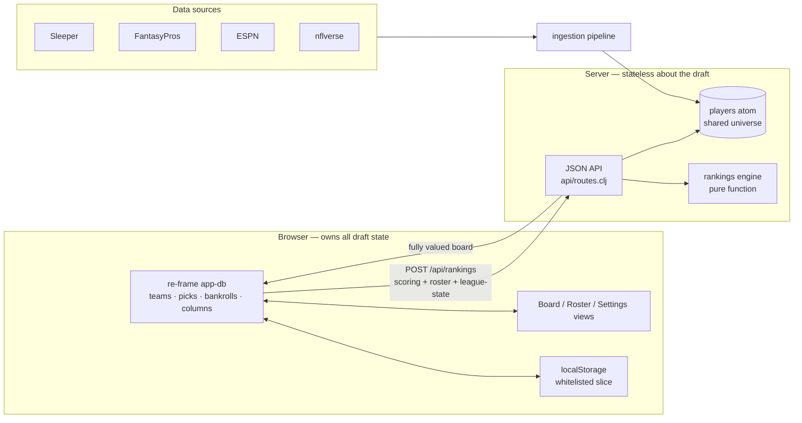
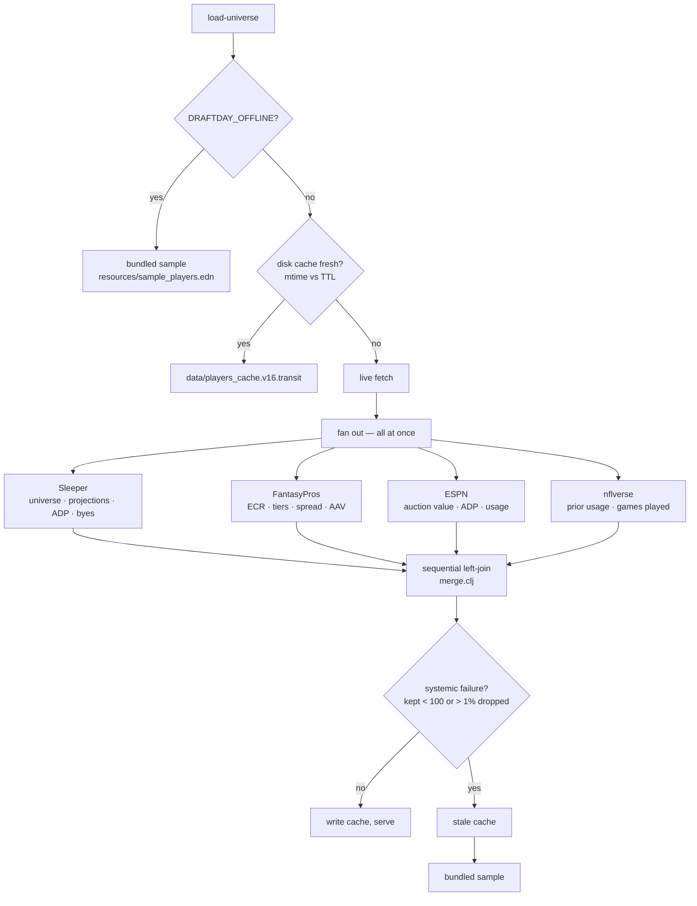

# Architecture

`src/clj` is the backend, `src/cljs` the SPA, `src/cljc` the code both halves
share — the app-db shape, the column catalog and the scoring table, which the
browser needs synchronously and the JVM needs to compute with.

The server keeps **no draft state**. The only thing it holds across requests is
the shared player universe. Every `POST /api/rankings` carries the browser's
entire `league-state` — teams, picks, bankrolls — so the rankings engine is a
pure function of `(players, scoring, roster-config, league-state)`. There is no
session to reconcile, no way for two tabs to disagree, and the whole valuation
is reproducible from one request body.

**Frontend flow**: `:boot` merges the persisted localStorage slice into
`default-db` → `:fetch-players` → `:recompute` → `:ranked-loaded` stashes the
response. Every mutating event re-dispatches `:recompute`. Two details carry
weight: each `:recompute` stamps a monotonic `:recompute-seq` that
`:ranked-loaded` checks before writing, because a full re-rank takes long
enough that overlapping requests answer out of order and a reply computed under
the *previous* scoring config could otherwise win; and the persisted slice is
stamped with `fx/storage-version`, so a blob written under any other shape is
dropped at boot rather than migrated — there is no in-place repair, and
changing a persisted shape means bumping that number.

**Accounts, leagues and phase.** A manager plays in more than one league across
more than one host, so `:accounts` (keyed `"provider:user-id"`) and `:leagues`
(keyed `"provider:league-id"`) are both maps, and `:active-league` names the one
the whole app is about. Each league holds its own scoring, roster settings and
last sync. `:config` stays at the top of app-db as the *active* league's copy,
so the rankings request and the board read one key and know nothing about
leagues; `db/set-config` / `db/update-config` are the only writers and mirror
into the active entry. Switching leagues re-runs both the draft board and the
waiver board. The phase (`db/phase`) decides which half is on screen: the draft
tabs (Board, League) or the season tabs (My Team, Matchup, Waivers, League).
Credentials sit on the account that owns them, and `/api/waivers` deliberately
carries none, since it never contacts a provider.

**The season boards.** `/api/waivers` and `/api/matchup` are stateless on the
same terms as `/api/rankings`. The waiver handler runs the static half
(`:points`, `:injury-risk`, `:pos-rank`) first, blends in what has happened
(`rankings/ros.clj`, see [waivers.md](waivers.md)), then scores free agents on
`:ros-points` with the replacement and VORP stages reused. The matchup handler
runs a leaner pipeline, a live provider fetch plus the week's projections, with
no VBD and no vendor columns.

## Ingestion

Fetches all start at once; the *joins* stay sequential and in a fixed order so
the `:sources` provenance report reads the same every run. Per-vendor
politeness lives with the vendor: FantasyPros is held to 3 in-flight
connections, because twenty simultaneous scrapes from one IP earn a 429 — and
a 429 here is not an exception but a silently empty column cached for a day.
The validation gate matters for the same reason: a live fetch that comes back
gutted throws rather than overwriting a good cache with a bad one.

## Rankings engine

```mermaid
flowchart LR
    subgraph static["static-rankings — once per scoring/roster config"]
        direction LR
        p1["model<br/>:points"] --> p2["projections<br/>:floor :ceiling"]
        p2 --> p3["replacement<br/>levels"]
        p3 --> p4["VORP<br/>:vorp"]
        p4 --> p5["tiers<br/>:tiers :tier"]
        p5 --> p6["injury<br/>:injury-risk"]
        p6 --> p7["pos-rank<br/>:pos-rank"]
    end

    subgraph live["live-valuation — after every pick"]
        direction LR
        l1["tcm<br/>:tcm"] --> l2["value<br/>:value"]
        l2 --> l3["inflation<br/>global"]
        l3 --> l4["phase decay"]
        l4 --> l5["per-position<br/>inflation"]
        l5 --> l6["worth<br/>:worth"]
        l6 --> l7["bargain<br/>:bargain"]
    end

    static --> live
    live --> mkt["market<br/>:market :edge"]
    mkt --> resp["JSON response"]
```

The split is the load-bearing part: the static half depends only on your
scoring and roster settings, so it is computed once; the live half is
everything a pick can move. Two ordering constraints are real — VORP must
precede tiering, because the overall tier scale cuts on VORP; and the
inflation band is applied exactly once, at the very end, to the finished
`position_inflation × phase_decay` product.
