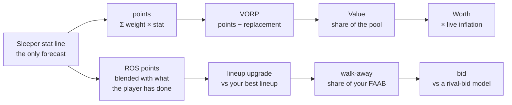

# How Draft Day predicts

Where the numbers on the board come from, what each one assumes, and where the
method is weakest. Formulas are the ones the code runs, with the namespace
beside each. The examples use the bundled sample universe
(`resources/sample_players.edn`) and reproduce offline.

**Draft Day does not forecast player stats.** It takes one forecast —
Rotowire's stat lines, served by Sleeper — scores it under your league's rules,
and does arithmetic on the result. Two pieces go beyond arithmetic: a shrinkage
estimator that updates the forecast as games are played, and a probabilistic
model of rival waiver bids. Everything else on screen is a display column.



**In brief.**

- **Predicted:** one thing, and it is bought — Sleeper's stat lines. The rest is
  arithmetic (points, VORP, dollars, inflation), one shrinkage estimator
  (rest-of-season) and one probabilistic model (rival waiver bids).
- **Trust:** scoring is exact for every rule it models. The rival-bid model
  (fit on eleven leagues, priced from 5,658 league-seasons) and the
  weekly-confidence table (one season) are measured; inflation, the
  floor/ceiling band and the rest-of-season prior are hand-set.
- **Biggest gaps:** injured players are priced as healthy in season, and
  nothing backtests the in-season numbers. Superflex leagues are mispriced, a
  known limitation that is deferred. Alternatives are in the last section.

## The forecast: stat line → points

```
points = Σ weight_k × stat_k          over the 88 keys in scoring/stat-keys
```

`scoring.cljc`, `ingestion/sleeper.clj`. Sleeper states tiers and bonuses *as
stats* (`pts_allow_7_13` arrives as `1.0`), so this is how Sleeper scores, not
an approximation of it: it matched Sleeper's own points to the cent for 166
rostered players under a real league's 85 rules
([scoring-coverage.md](scoring-coverage.md)). The presets name 29 keys and
differ only in the reception weight (0, 0.5, 1.0). The season line is sparse,
so its gaps are filled from the week-one line scaled by the player's implied
games (season ÷ weekly `pts_ppr`, capped at 17). Made field goals are exempt,
because the two lines disagree about that grid.

**Floor and ceiling** (`projections.clj`) are a heuristic, display only:

```
band = k_pos × min(1, rank_std / 10)        floor, ceiling = points × (1 ∓ band)
```

`rank_std` is how far FantasyPros' experts disagree on the player's rank;
`k_pos` is hand-set (QB 0.20, RB and WR 0.35, TE 0.40, K 0.15, DST 0.25). No
harness checks that the bands cover what happens.

## Draft day: points → dollars

```
level_pos = points of the player at index  teams × starters_pos + flex_claims_pos
            in that position's list, best first
vorp      = points − level_pos                  signed; nil for K and DST
value     = 1 + vorp / Σvorp × (pool − slots)   Σ over the paid players, rounded
```

`replacement.clj`, `value.clj`. **Flex claims are measured:** everyone left
after the dedicated starters is ranked together and the best
`teams × flex_spots` are counted by position. In the sample the twelve flex
seats go RB 7 / WR 5 in standard and WR 12 / RB 0 in PPR. Below replacement
every player costs $1 until the roster slots run out, shared across positions
by largest remainder; K and DST cost $1 for exactly as many as the roster
drafts.

**Worked example** (sample, PPR, 12 teams × $200, 15 slots). The pool is $2,400
and each of 180 slots costs at least $1, which leaves $2,220 over the 84
players above replacement, whose VORP sums to 3,953.7: $0.56 a point. Values
sum to the pool, and 97 players sit at $1.

| Player | Points | Replacement | VORP | Value | Worth at ×0.91 |
| --- | --- | --- | --- | --- | --- |
| Jahmyr Gibbs (RB) | 329.4 | 171.0 | 158.4 | $90 | $82 |
| De'Von Achane (RB) | 257.4 | 171.0 | 86.4 | $50 | $46 |
| Tetairoa McMillan (WR) | 221.0 | 174.3 | 46.7 | $27 | $25 |
| Jayden Reed (WR) | 197.6 | 174.3 | 23.3 | $14 | $13 |

After every pick the board is re-priced (`inflation.clj`,
`inflation_index.clj`):

```
inflation = clamp( (cash_left − slots_left) / Σ max(0, value − 1)
                   over the top slots_left undrafted, 0.5, 1.8 )
infl_pos  = inflation × (1 + 0.5 × (paid_pos / par_pos − 1) × par_pos / (par_pos + 20))
mult      = clamp( infl_pos × (1 − 0.2 t²), 0.5, 1.8 )      t = slots filled ÷ slots
worth     = round( 1 + (value − 1) × mult )                 ← the number to bid to
bargain   = value − worth
```

Inflation is the money left in the room above $1 per open slot, divided by the
premium left on the board: 1.0 at the open, below 1.0 once the room has
overspent. `paid_pos / par_pos` is what a position's picks cost against model
value, shrunk by `par / (par + 20)` so a $3 bid on a $1 player cannot swing it.
`1 − 0.2 t²` fades the multiplier as rosters fill, and the band is applied once,
at the end. `Mkt` (ESPN and FantasyPros auction values rescaled to your pool)
and `Edge = worth − Mkt` are display only.

## In season: updating the forecast

```
rate_k = (6 × preseason_k / season_games + realized_k) / (6 + played)
ros_k  = rate_k × games_remaining
```

`ros.clj`. A credibility weighting: the weight on realized per-game production
is `played / (played + 6)` — half after six games, 54% after seven — and at
zero games it is the prorated preseason line (rookies, defenses, August). A
player with no preseason line is discounted on purpose, since production is
spread over `6 + played`. The 6 (`PRIOR-GAMES`) is chosen, not measured.
*Example:* a back projected for 1,020 rushing yards (60 a game) who has 560 in
7 games (80 a game) through week 8 has a rate of (6 × 60 + 560) / 13 = 70.8,
so 10 games left is 707.7.

`games_remaining = (18 − through_week) − bye_left`, with `bye_left` 1 if the bye
is ahead, 0 if past and `weeks_left / 18` if unknown. Realized production is
Sleeper's where it exists and nflverse's otherwise, never mixed. VORP is
recomputed on `ros-points` over the whole league, since over free agents alone
replacement would sink with every good player added.

This week's `week-points` is not blended: it is Sleeper's weekly line, scored.
Recent form sits beside it; `waiver.clj` records that folding it in "bought
+0.37%".

**How far to trust a weekly gap** (`confidence.cljc`), measured on 2025: for two
same-position players in the same week, how often did the higher-projected one
outscore the other?

| Rank gap | QB | RB | WR | TE | K |
| --- | --- | --- | --- | --- | --- |
| 1 | 52% | 51% | 48% | 49% | 47% |
| 3 | 51% | 53% | 48% | 52% | 50% |
| 8 | 58% | 59% | 54% | 56% | 48% |
| 12 | 59% | 64% | 56% | 64% | 51% |
| 30 | – | 84% | 67% | 81% | – |

Adjacent ranks are a coin flip and kickers never separate, so the compare tile
says so instead of drawing a lean bar. Cross-position pairs and defenses get no
verdict. It is one vendor, one season, half-PPR.

## Waivers: what a claim is worth, and what to bid

`lineup.clj`, `waiver.clj`, `faab.clj`. Points all the way until the bid.

**Lineup upgrade** — what a claim adds to your starting lineup, on `ros-points`:

```
lineup_upgrade = best_lineup(roster − drop + player) − best_lineup(roster)
```

The lineup is filled greedily, narrowest seat first, which is optimal when
seats nest (dedicated ⊂ FLEX ⊂ SUPER_FLEX). The drop is whoever costs the
lineup least, ties going to the fewest ROS points; with a seat open, nobody.
`upgrade` is the cruder bench delta. The Matchup tab reuses the solver on
`week-points` and, once every game is final, on actual scores.

**Walk-away** — what the player is worth to you, in FAAB dollars:

```
gain_i      = max(0, g_i − best other free agent's g at that position)
share_i     = gain_i / Σ(top n gains in its pool) × pool         n = waiver runs left
walk_away_i = round( min(share_i, FAAB left, market_cap(position)) )
```

`g` is the lineup upgrade where positive, else the bench upgrade. Free agents
at a position are substitutes, so only the best one carries weight: with
receivers at +10, +8 and +1 and a tight end at +5 on the wire, the best
receiver's gain is 2, the other receivers' are 0 and the tight end's is 5. 85%
of your FAAB goes to players who would start and 15% to bench stashes
(`stash-share`, chosen), an empty pool handing its share to the other.
`market_cap` is the 90th percentile of what Sleeper managers pay in auctions
with four or more bidders, scaled by position (against a receiver, a kicker or
defense about 0.4× and a quarterback about 1.5×) and by your budget.

**Bid** — a prediction of the rivals:

```
bid        = argmax_b  P(win | b) × (walk_away − b)
P(win | b) = E_η  ∏_rivals [ 1 − p + p × ( F(b − 1) + tie × f(b) ) ]
p          = 1 − exp(−η λ)           λ = claims_per_week × softmax_players(utility)
utility    = Σ w_k feature_k + heat + 0.644 × [rival would start the player]
η          ~ Gamma(mean 1, shape (Σλ, mine included) / 1.43), given my own claim
```

Each rival makes a Poisson number of claims a week and spreads them over the
wire in proportion to e^utility, a conditional logit fit to real claims on:
played in the last three weeks, last week's points, season points a game, value
over replacement and its square, just dropped, position, and whether the rival
would start the player. `heat` is the player's place on Sleeper's trending-adds
list. `η` is the week's shared news: one gamma draw scales every rival's rate
at once, so bids pile up on the same player. `F` and `f` are a rival's bid
distribution, measured Sleeper-wide by bidder count and phase of the season,
scaled by position, budget and that manager's habits, heaped on round numbers,
and capped at their FAAB. `tie` is 1 if your waiver priority is better, else 0
(0.5 when unknown). Habits — claims a week, share of bids at $0, aggression —
start at the Sleeper-wide median and move toward the manager's own history as
bids accumulate: pseudo-counts of 2 weeks and 8 bids, current-season bids
decaying with a four-week half-life, last season's counting half.

The other outputs are `bid-sure` (the cheapest bid that wins 90% of the time),
`typical-bid` (the median top rival bid) and `rivals` (the expected number of
bidders). `/api/waivers` computes all of it; the UI hides it while
`db/bid-predictions?` is false.

## What is measured, and what is chosen

| Piece | Status | Basis |
| --- | --- | --- |
| Stat projections | bought | Rotowire via Sleeper; nothing in the repo forecasts |
| Floor and ceiling `k_pos`, `÷ 10` | hand-set | no harness checks coverage |
| Flex claims | derived | read off the board on every request |
| Inflation band 0.5–1.8, decay 0.2, β 0.5, shrink 20 | hand-set | docstrings give reasons, not fits; `replay.report` scores Worth against real auction prices |
| `PRIOR-GAMES` 6, `stash-share` 0.15 | chosen | docstrings say "chosen, not measured" |
| `claim-weights`, `cluster-spread` 1.43 | fit | real claims from 11 leagues, scored held out league by league (`faab.interest`) |
| Bid cells, position, budget and size shifts, heaping | measured | 5,658 Sleeper league-seasons, 754,611 auctions (`bid-prior`); the crawl skews superflex and dynasty |
| `heat-weight`, `cap-quantile` 0.9, `threat-floor`, habit pseudo-counts | chosen | docstrings say CHOSEN |
| Rank-gap win rates | measured, narrow | 2025 Rotowire weekly vs actuals, half-PPR, one vendor and season |
| Injury bands | calibrated | to the spread of the draftable pool; a display scale, not a predictor |

## What it deliberately does not do

- **No stat forecast of its own.** Two blends of ADP and prior usage into points
  looked better over two seasons and lost over five (`model/blend.clj`).
- **Display columns feed no price.** Tiers, `tcm`, injury risk, `Mkt` and
  `Edge`, and positional rank are never summed into Worth: the market already
  prices what they know, and a signal that re-enters a price charges for it
  twice.
- **No auction dollars in season.** A claim is one seat bought from a budget
  spent down over months, not a roster bought from a bankroll.

## Gaps, improvements and alternatives

Nothing ships on argument — `model/blend.clj` holds two ideas that won on two
seasons and lost on five — so each item names what would judge it. These are
recommendations; none is implemented.

### Known limitation, deferred

**Superflex leagues are mispriced.** A `SUPER_FLEX` seat imports as a bench seat
from Sleeper and as an RB/WR/TE flex from ESPN, so quarterbacks are under-valued
on the draft board and the waiver lineup has no seat for a second quarterback.
Treat the numbers in a superflex league with caution.

### Gaps with a known fix

**1. Injured players are priced as healthy.** The designation
(`:sleeper/injury-status`) reaches the `Inj` column, the player card, the
durability scale and the matchup row, but never the server's rest-of-season
blend, `:lineup-upgrade`, `:walk-away`, the rivals' needs or the bid features:
two identical backs, one on IR, both come out at 87.7 ROS points. The draft
board ignores injuries because the room already prices them, and that argument
does not reach your own walk-away. *Fix:* zero the games remaining for
`db/serious-injury?` designations (IR, PUP, NFI, suspension, NA, DNR) until they
clear. *Alternatives:* an expected-games-lost table per designation (Sleeper
gives no return dates, so it needs history), or warn only, as `Inj` does today.
Judge it on item 2.

**2. There is no in-season backtest.** The benchmark scores preseason draft
boards only, so `PRIOR-GAMES`, `stash-share`, the rest-of-season blend and the
weekly projection have never been scored against what happened. The data
exists: nflverse and Sleeper actuals, plus the benchmark's vintage preseason
projections. *Harness:* for each season and week `w`, rank players on the
`ros-points` computable through `w`, score against points scored in weeks
`w + 1…` by position, against two baselines — the prorated preseason line and
realized points a game.

**3. Nothing re-derives the weekly-confidence table, or keeps what it would
need.** `win-rates` came from a one-off 2025 pull (no script in `dev/` produces
it), and the weekly projection cache is one TTL file that overwrites itself,
where trending lists are archived under `data/trends/`. Archive each week's line
the same way, add a report that regenerates the table, and fill the rows it
lacks: defenses, and the deep-pool split that matters most for waivers
(`docs/TODO.md`).

**4. ESPN leagues bid blind.** `ingestion/transactions` has only a Sleeper
provider, so ESPN rivals are priced from Sleeper-wide data alone, and
`:playoff-week-start` is deliberately unread, so `claims-left` errs long and
every walk-away errs small (`docs/TODO.md`).

**5. The header's market multiplier can disagree with the board.**
`live-valuation` returns the banded `:market-multiplier`, but `rankings-handler`
ships only `[:inflation :inflation-index :market-heat]`, so the header
recomposes the product without the 0.5–1.8 band and can read ×0.40 against a
board priced at ×0.50. One line (`docs/TODO.md`).

### Alternatives to the current methods

| Today | Alternative | Pros | Cons | Verdict |
| --- | --- | --- | --- | --- |
| **Stat forecast:** one vendor | A mean across vendors, as `market.clj` does for prices | Independent forecasts average better (`docs/TODO.md`); scoring is linear, so averaging stats equals averaging points | An ingestion and an id join each; vintage data to validate is scarce; two blends already lost; no in-season harness | Worth it if the draft benchmark can score it |
| **Floor/ceiling:** heuristic band | Empirical quantiles of actual − projection, per position | A real p10/p90 with checkable coverage; no hand-set constants | Thin history per position (`--source-report`); missed games blend availability into performance | Cheap and display-only |
| **Value:** linear in VORP | Value ∝ VORP^γ, or the measured rank → share-of-pool curve (`replay/price_curve.clj`) | Matches how rooms pay; `replay.report` already scores it | Fitting the room makes Bargain and Edge circular; a price forecast is not a value to bid to | Test γ; keep VORP as the value |
| **Replacement:** static, last starter | A: recompute after every pick. B: a deeper, waiver-wire level | A: scarcity updates at once. B: reflects what you could pick up; values depth | A: double-counts the position tilt, Values stop summing to the pool, jitter. B: benches are league-specific; flattens the curve | B is the better test; A is risky |
| **Worth:** the room's price | Marginal value to *your* roster: `lineup/upgrades` on `:points` at $0.56 a VORP point; or a full budgeted optimization | A third elite RB is worth less to a team with two; the code exists | Myopic early; needs the points-to-dollars rate; can double-count; optimization needs a price for every player | Promising; judge in `benchmark.report --simulate` |
| **Inflation:** hand-set constants, aggregate cash | Fit them on the replay corpus by league type; or model who can still pay (cash and open seats per team) | Data-driven; the richest bidder sets the price | A pooled constant "is fitted to one format and shipped to every league"; four constants on a few dozen drafts overfit; a demand multiplier was built and removed | Needs a corpus split by league type (the replay corpus is mostly superflex) |
| **ROS:** one prior strength | Per stat and position by split-half reliability; or opportunity × efficiency, regressing touchdown rate | Yardage and volume settle faster than touchdowns; K and DST are mostly noise; usage is already ingested | Needs the missing backtest; more constants; the last two new models lost | After item 2 |
| **Weekly gap:** three rank bands | P(A outscores B) = Φ((μA − μB) / √(σA² + σB²)), σ growing like √μ (median error measured near 1.4 √μ) | Continuous; works across positions and for defenses; could drive variance-aware lineups | The √μ constant is half-PPR-specific; ignores same-game correlation; needs a reliability check | Low priority |
| **Walk-away:** conserving share | A shadow price λ set so expected future claims exhaust the budget; or dollars a point implied by the league's winning bids | Explicit opportunity cost; handles timing; anchors to the market | Needs a forecast of future wire gains; revealed prices are not optimal; the current rule has the right limits | Worth testing: the bid never exceeds the walk-away (unless the league minimum does) |
| **Free option:** best other free agent | The best other free agent *likely to still be there*, from the rival model's claim chances | The second-best receiver is not worth $0 when the best is contested | Circular; heavy (it asks every rival's lineup about every free agent); the model is fit on 11 leagues | Test with the shadow price in `faab.replay` |
| **Rival bids:** structural model | Predict the winning bid directly: quantile regression or boosting | Fewer parts; standard metrics | Cannot name rivals or use manager history; features rebuilt per historical auction; opaque | Keep the structure; use this as a baseline to beat |
| **Defense tiers:** one-hot buckets | A distribution built from the real-valued `pts_allow` beside them (`docs/scoring-coverage.md`) | Prices shutouts and tier rules | Needs an empirical model; matters mostly in season, since K and DST are $1 on the draft board | Low priority |

For the rival-bid model, keep the structure and improve it in this order: refit
`claim-weights` on more leagues, by league kind (twelve weights from eleven
leagues today); let a rival's bid size depend on their own gain, not only
whether they bid; fit `heat-weight` from the trend snapshots as they
accumulate; and give a new league per-rival habits from each manager's other
leagues, which correlate 0.37 to 0.56 (`docs/TODO.md`).

### The order I would do them in

1. Injury-aware rest-of-season (item 1): small, guarded by `db/serious-injury?`.
2. Start archiving weekly projections, and run `tools.trends` on a schedule all
   season. Sleeper keeps no past trending lists, so that data cannot be
   recovered later.
3. Build the in-season backtest (item 2). It unlocks `PRIOR-GAMES`,
   `stash-share`, per-stat priors and the weekly-confidence alternative.

The market-multiplier line (item 5) can go in any time. Everything else only if
a harness says so.
